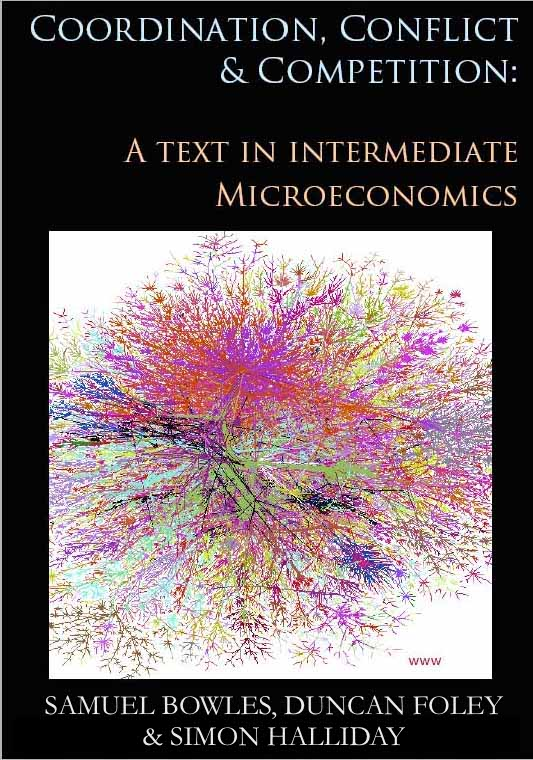
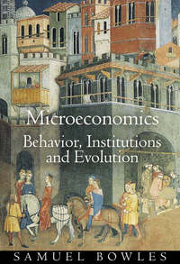

```{r setup, include=FALSE}
library(tufte)
library(knitr)
```

```{r cccbook, fig.margin = TRUE, fig.cap = "Provisional Cover", fig.width=3.5, fig.height=3.5, cache=TRUE, echo = FALSE}

```

> "Most of the people in the world are poor, so if we knew the economics of being 
> poor, we would know much of the economics that really matters ..."
>
> `r tufte::quote_footer('--- T. W. Schultz, 1980 [1979], Nobel Address: The Economics of Being Poor, p. 639')`

## Introduction
[Samuel Bowles](http://tuvalu.santafe.edu/~bowles/), [Duncan Foley](https://sites.google.com/a/newschool.edu/duncan-foley-homepage/home) and I (Simon Halliday) have an ongoing joint project writing an intermediate microeconomics textbook: *Microeconomics: Competition, Conflict and Coordination* (henceforth CCC). On this site, you will find preliminary content that we are providing to test-teachers who are planning to use draft chapters of the book as well as tips and pointers to do with teaching the book. 

```{r teampic, fig.margin = TRUE, fig.cap = "Simon, Sam and Duncan at SFI, Summer 2015", fig.width=3.5, fig.height=3.5, cache=TRUE, echo = FALSE}

```

If you wish to sign up to be a test-teacher of the book (or even just a test-reader), then please provide your details in the following Google form so that we can gather your details. (If you're unable to see the embedded form below, then please click [here](https://docs.google.com/forms/d/1MX3F0zZ41SGY5s3z2qrnmt9BEZa-x2x2yp9JlcdAH-w/viewform)). 

<iframe src="https://docs.google.com/forms/d/1MX3F0zZ41SGY5s3z2qrnmt9BEZa-x2x2yp9JlcdAH-w/viewform?embedded=true" width="760" height="500" frameborder="0" marginheight="0" marginwidth="0">Loading...</iframe>

We believe the book is now ready to be taught by other professors, especially those interested in how economics has changed over the past thirty years. Once you have reviewed chapters of the book we'll ask you to provide feedback to us in another Google Form (to be provided later). The book is under review by prospective publishers (summer 2017). 

##What are the flavors CCC?
```{r fig-margin2, fig.margin = TRUE, fig.cap = "MBIE, 2006, PUP", fig.width=1, fig.height=1, cache=TRUE, echo = FALSE}

```
Though written for undergraduates,  in content CCC has a strong flavor of Sam's graduate-level textbook, [*Microeconomics: Behavior, Institutions, and Evolution*](http://press.princeton.edu/titles/7610.html) published by Princeton University Press in 2006. As an advanced text, though, it is not suitable for many undergraduate classes because of the high level of the math and certain other aspects of its theoretical rigor. 

```{r fig-margin3, fig.margin = TRUE, fig.width=3.5, fig.height=3.5, cache=TRUE, echo = FALSE}
knitr::include_graphics('./images/logo-red-black.png')
```


```{r production intro, fig.margin = TRUE, fig.cap = "Example page: Introductory page to Chapter 8: Production: Technology, Costs and Supply", echo = FALSE}
knitr::include_graphics('./images/BFHMicro_production_intro.jpg')
```

```{r eos ppf, fig.margin = TRUE, fig.cap = "Example page: figure in chapter 7 on Economies of Scale and the Production Possibilities Frontier", echo = FALSE}
knitr::include_graphics('./images/BFHMicro_eos_ppf.jpg')
```

CCC would also be an excellent follow-up text for introductory economics courses that use the *The Economy* produced by the Curriculum Open Access Resource in Economics ([CORE Project](http://www.core-econ.org/)) directed by [Wendy Carlin](http://www.core-econ.org/contributors/) and of which Sam is a co-author. 
CORE's *The Economy* is based on many similar themes to CCC.  

##What are the themes of CCC?

We cover many of the standard economic concepts taught to second-year or intermediate-level economics students including constrained optimization, opportunity costs, trade-offs, complements and substitutes, Nash equilibrium, Pareto efficiency and risk. 

But many of the themes of the book are unlikely to be encountered in most intermediate microeconomics texts. 

- *What is economics about?*  we go beyond the usual focus on markets and deal with the full range of social interactions and how people seek to coordinate their activities so as to secure their well being, including "the wealth and poverty of nations and people," environmental degradation, and conflict over the division of mutual gains from trade.
- *Evidence*: economics is an empirical science that relies on  experiments -- from the lab and the field -- and survey and other data to test its theories about how people, organizations, and economies behave and to illustrate applications of these theories to public policy.
- *Preferences*: people are both generous and self-interested, morally motivated and amoral and we respond to social norms of fairness.
- *Economic actors*: firms, banks, buyers and sellers are often price-makers rather than passive price-takers. 
- *Rents*: social interactions allow gains from trade, but "the market" alone does not determine how these rents will be distributed.
- *Institutions*: institutions -- laws, norms, and mutual expectations -- affect how social interactions unfold and who gets what and why.
- *Efficiency and fairness*: outcomes are evaluated along the dimensions  of efficiency and fairness rather than solely by the Pareto criterion.
- *Power and social norms*: because contracts are incomplete in labor, credit and other important markets, the terms of an exchange depend on the exercise of power and norms other than the simple pursuit of self-interest.
- *A micro-foundation for a new macro*: equilibrium unemployment and wealth constraints on borrowing provide the basis of a modern macroeconomics, without special *ad hoc* assumptions. 
- *Increasing returns*: along with other sources of positive feedbacks, result in multiple equilibria in many situations, so that history matters because history may determine which equilibrium prevails. 
- *External effects*: positive and negative external effects ("externalities") pervade social interactions and people and firms routinely make decisions that affect how well or how poorly their counterparts will do.

##Provenance
It’s hard to know exactly where your own ideas come from, but  for us, those implicated certainly include:

- *Adam Smith*  taught us that people are both selfish and other-regarding and that  markets are  coordination devices that under some conditions  allow socially desirable decentralized solutions to the question of how society's resources should be used. 
- *Karl Marx* stressed that conflicts over the products of human labor are an intrinsic feature in any economy,  that our preferences are shaped by our circumstances and that capitalism is a moving target that requires dynamic analysis.
- *Augustin Cournot* the mathematician, taught economics  to formally model how profit-maximizing firms interact in situations different from what later came to be called "perfect competition."
- *Alfred Marshall* studied markets both  factually and mathematically,  giving us an exemplar of empirically grounded formal reasoning in microeconomics.
- *Friedrich Hayek* pioneered the idea that markets are information-processing mechanisms and that economics is about how changing information results in changes in the economy.
- *Ronald Coase*, like Marx, stressed the importance of power as an economic concept and the importance of firms and other non-market institutions and also taught that market failures and other social problems can be addressed by a combination of private bargaining and governmental intervention.
- *Elinor Ostrom*, the political scientist, was honored with a Nobel in economics for demonstrating the power of a multi-disciplinary and empirical approach to understanding how societies can confront their environmental and other coordination problems. 

We incubated many of these ideas at the Santa Fe Institute (where Duncan and Sam serve on the faculty), a center of interdisciplinary and dynamic problem-centered modeling. 

##Contents
Below is an abridged table of contents for the first 12 chapters of the book. Currently the first ten chapters are available for distribution with chapters 11 and 12 under active revision over the summer. We plan to have a final part, Part 3, which will go into greater depth on advanced topics, such as the fundamental welfare theorems (and criticisms thereof) and a final reflection on the institutions of capitalism. You can access a more comprehensive draft table of contents [here](https://drive.google.com/file/d/0B9jjwkjdUJU7R1hnZ25UWTJTYWc/view?usp=sharing) and a copy of the preface [here](https://drive.google.com/file/d/0B9jjwkjdUJU7dGViNm1MNm15NXc/view?usp=sharing). 

| Chapter  | Title   |
|---|---|---|
| Preface | - |
| Part I | People, Economy & Society |
| 1 | Society: Coordination Problems & Economic Institutions |
| 2 | People & Preferences |
| 3 | Constrained optimization: Doing the Best You Can | 
| 4 | A Risky & Unequal World |
| 5 | Property & Exchange: Mutual Gains & Conflicts | 
| 6 | Coordination Failures & Institutional Responses| 
| Part II | Markets | 
| 7 | Specialization, Exchange & Market Demand | 
| 8 | Production: Technologies, Costs & Supply | 
| 9 | Competition, Rent-Seeking & Market Equilibrium |
| 10 | Information: Contracts, Norms & Power |
| 11 | Jobs, Unemployment, & Wages |
| 12 | Interest, Credit & Wealth Constraints |
| Part III | Economic Systems: Ideal & Imperfect | 
| 13 | Perfect Competition & the Invisible Hand |
| 14 | Capitalism: Innovation & Inequality | 

##Calculus and Graphics
We use calculus in the book, but almost all of the calculus is contained in boxes (named for Alfred Marshall as you will see). 
We try to follow Marshall's maxims with the mathematics:  

```{marginfigure}
Alfred Marshall, 1906, Letter to Arthur Lyon Bowley. Collected in A. C. Pigou, 1966, *Memorials of Alfred Marshall*, pp. 427-428.
```

> "I had a growing feeling in the later years of my work at the subject that a good mathematical theorem dealing with economic hypotheses was very unlikely to be good economics: and I 
> went more and more on the rules
>
> 1. Use mathematics as a shorthand language, rather than an engine of inquiry. 
> 2. Keep to them till you have done.
> 3. Translate into English. 
> 4. Then illustrate by examples that are important in real life. 
> 5. Burn the mathematics. 
> 6. If you can't succeed in (4), burn (3). 
>
> This last I did often."

We may not have burned as much of the mathematics as we ought to have done, but we try to restrain the mathematics to when it is most necessary. 
For the most part, the economics is conveyed through *graphical* intuition accompanied by algebra. 
All of the graphics are also available on github (see Simon Halliday's github repo [bfh-textbook](https://github.com/simondhalliday/bfh-textbook/)). 
We hope later to provide interactive versions of the majority of the important graphics programmed either in R with Shiny or Mathematica.   

Note, too, that although we do not use Lagrangians in the book to teach constrained optimization, we do cover them in an appendix and provide examples and worksheets using Lagrangians for those instructors who chose to teach them in their courses.

##Course Materials
Once we have provided you with draft chapters of the book, Simon will share a Google drive folder with you that contains slide decks, problem sets, quizzes, worksheets, etc. Simon has test-taught the book at Smith College and much of this content is based on the course he taught along with content that Duncan Foley has used when teaching at [Eugene Lang College](http://www.newschool.edu/lang/) (the undergraduate liberal arts college attached to the New School for Social Research). In the fall of 2016, the book was used by [Stephen Kinsella](http://www.stephenkinsella.net/) at the University of Limerick, Ireland and [Arjun Jayadev](http://azimpremjiuniversity.edu.in/SitePages/arjun-jayadev.aspx) of Azim Premji University, India. In the spring of 2017, the book was taught in large intermediate micro classes at the University of Massachusetts at Amherst, USA by [Daniele Girardi](https://www.umass.edu/economics/girardi) and Sai Madhurika Mamunuru, Azim Premji by [Anand Shrivastava](https://sites.google.com/site/anandshrivastava1984/), and the University of Cape Town, South Africa by [Justine Burns](https://sites.google.com/site/justinecburns/). 
This classroom experience is the basis of a rapidly expanding set of problems, quizzes, lecture slides and other teaching aids.

##Quizzes
We will be providing access to multiple choice and checkbox quizzes for each chapter which we hope to have for each chapter after the summer. 

##Flashcards
The book has a glossary with all the definitions used in the book. Over the next academic year we hope to turn the definitions into a set of flashcards using [Anki](http://ankisrs.net/). 
Anki is an open-source flash-card service where the desktop and web-interfaces can be used free of charge, as can the Android app. 
But, the iOS app version needs to be bought for a fee of $25. 
As the web interface and desktop versions are free of charge and the notebooks are exportable to other formats, we still think it is the best current option. 
You will be able to import the flashcard decks to your Anki app when these are made available. 
They will be provided chapter-by-chapter over AY2017-18. 

##Pedagogical Approach

Our objective is not simply to teach students “how economists think” by algorithmic training using toy models, but to to teach economics as a social science: an inquiry into the main challenges our society faces and the policy options available to us to confront the challenges.

To do this we begin each chapter with one or more empirical puzzles or historical episodes that economic theory should be able to illuminate. Models are taught as a way of addressing real world problems and questions. 

Our approach is informed by the latest ideas in the learning sciences. 
```{marginfigure}
See, for example, Brown, Roediger and McDaniel, 2014, *Make It Stick*, Harvard University Press/Belknap Press, Cambridge, MA. 
```

- With our quizzes, we recommend regular *testing* to improve learning and retention; students obtain immediate feedback and the instructor can respond to student needs (quizzes and flashcards assist with this)
- With in-class worksheets and think-pair-share exercises enabled by the worksheets, students again get *immediate feedback* and can learn by teaching each other
- We repeat the use of economic ideas throughout the book -- students learn a core set of economic ideas and apply them to a diverse array of problems -- and space them with the introduction of new ideas so that students go to and fro between new and old ideas, and between old and new applications of familiar ideas
- We recommend that instructors *space out practice* using the quizzes, problem sets and worksheets
- Attempting a problem *before knowing a solution* provides learning benefits (even when getting to an incorrect solution initially) 
- *Varied* practice is important to learning, which again motivates our use of the different types of testing and learning work (quizzes, worksheets, problem sets)
```{marginfigure}
*Elaboration* is "the process of giving new material meaning by expressing it in your own words and connecting it with what you already know." (Brown, Roediger and McDaniel, 2014, p. 5)
```
- Simon also asks students to engage in a practice where he distributes index cards and students write 3 ideas they remember from the previous class and to explain them in their own words (for a Monday class recalling a Friday class this is particularly useful). Simon has found this practice to be useful because it involves both practicing *recall* and *elaboration*. 
