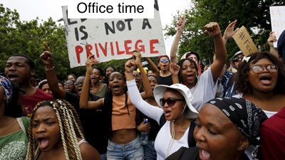
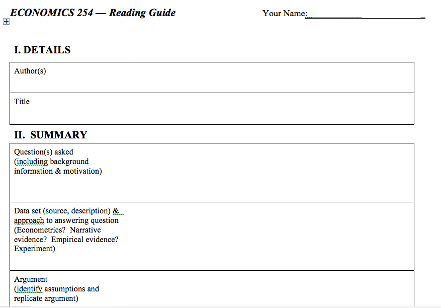
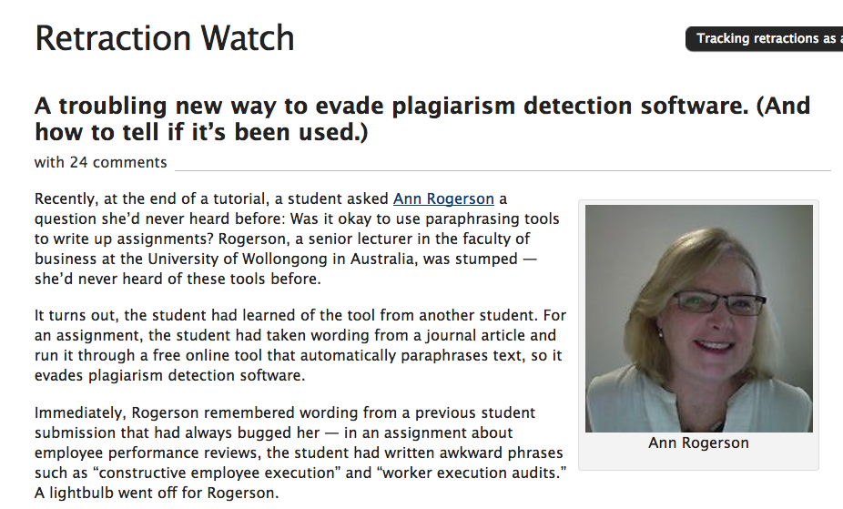

## So... 

What have we:

 - read? 
 - seen? 
 - heard? 

## Writing assignment

```{r, fig.cap = "A typical student response", out.width='60%', echo = FALSE, fig.align = 'center'}
knitr::include_graphics('more/writing.jpg')
```

## Scaffolded

```{r, fig.cap = "Scaffolding", out.width='60%', echo = FALSE, fig.align = 'center'}
knitr::include_graphics('more/scaffold.jpg')
```


## Large class
```{r, fig.cap = "Large Class", out.width='60%', echo = FALSE, fig.align = 'center'}

```

## Output: Opinion Piece

```{r, fig.cap = "I can haz opinions...?", out.width='60%', echo = FALSE, fig.align = 'center'}
knitr::include_graphics('more/opinion.jpeg')
```


## Objectives? 


- Goals
- Efficiency
- Scalability


## How? 

- Critical Reading
- Good rubrics 
- Revision & Peer editing

## Resources? 

```{r, fig.cap = "Peer Scholar", out.width='80%', echo = FALSE, fig.align = 'center'}
knitr::include_graphics('more/peerscholar.png')
```

I look forward to testing this, even in smaller classes. 

## Op-ed as RE-action (helps grading too)
```{r, fig.cap = "Reactions?", out.width='100%', echo = FALSE, fig.align = 'center'}
knitr::include_graphics('more/reactions.png')
```

- Good to give a baseline 
- How different to a response paper?
- Knowledge-building & half-formed thoughts

## Main criticism...? 
 > "It would be useful to analyze student writing more systematically to see in what areas student most and least improve and how we can adapt the assignments and activities accordingly" (p. 20)

- What about analyzing student reading first too? 
- Pre- and post-test? 
- Follow-up next semester? 
- Compare to 'standard' Intro course students?

## Inciting rebellion at my school...
 > "We have eliminated in-person office hours for lack of demand, and there are no tutorials for these courses" (p. 19)

- Totally infeasible for me
- Have your students been coached on *how* to use office hours? 

```{r, fig.cap = "No office hours? Hell no!", out.width='60%', echo = FALSE, fig.align = 'center'}

```

## Reading guides? 
```{r, fig.cap = "Reading guide? - Olney", out.width='80%', echo = FALSE, fig.align = 'center'}

```

## Reading guides? 
```{r, fig.cap = "Reading guide? - Olney", out.width='80%', echo = FALSE, fig.align = 'center'}
knitr::include_graphics('more/guide2.png')
```


##Other points

Grading

- Institutional differences: LAC/Uni
- Hard for me to implement a 'zero' for late policy

Distribution across articles they react to? 

- how many per article? 
- inequality in grading for TAs? 

##Other points 2

Grading rubric? 

- can a student get full points? 

Syllabus?

- do they read it? 
- do you have a syllabus quiz?

Upper level courses?

- How do we adapt this to intermediate courses? 
- Higher courses? Seminars? How to make more ambitious?

##Plagiarism bites again...as paraphrasing tools
```{r, fig.cap = "New ways to plagiarize", out.width='60%', echo = FALSE, fig.align = 'center'}

```

## Thank you!

