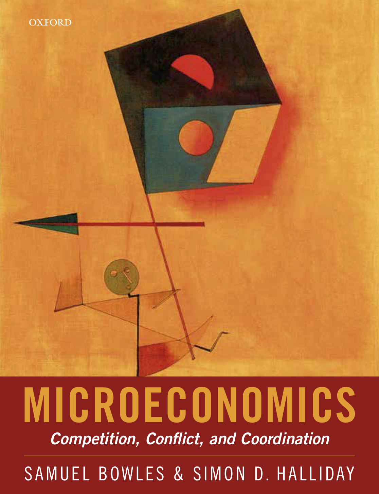

```{=html}
<section class="home-hero" aria-labelledby="home-title">
  <div class="home-hero__text">
    <p class="home-eyebrow">Economics as a way to understand civic life</p>
    <h1 id="home-title">Teaching, research, and open textbooks for <span>power, progress, and public purpose.</span></h1>
    <p class="home-lede">
      I build courses, books, videos, and research projects about how people
      cooperate, bargain, learn, and make decisions inside institutions.
    </p>
    <div class="home-actions" aria-label="Primary links">
      <a class="home-button home-button--primary" href="teaching/">Start with Teaching</a>
      <a class="home-button" href="research.html">View Research</a>
      <a class="home-button" href="https://youtube.com/@simondhalliday3919?si=hkWUr5FZl4NIeGhg">Watch Videos</a>
    </div>
  </div>

  <div class="home-feature-grid" aria-label="Featured work">
    <a class="home-book-card home-book-card--micro" href="microeconomics/">
      <span class="home-book-cover">
        
      </span>
      <span class="home-card-copy">
        <span class="home-label">Textbook</span>
        <strong>Microeconomics</strong>
        <span>Competition, Conflict, and Coordination, with Samuel Bowles.</span>
      </span>
    </a>

    <div class="home-side-stack">
      <a class="home-image-card home-image-card--uoe" href="https://books.core-econ.org/understanding-our-economy/">
        
        <span>
          <span class="home-label">Open textbook</span>
          <strong>Understanding Our Economy</strong>
        </span>
      </a>

      <a class="home-research-card" href="research.html#works-in-progress">
        <span class="home-label">Research</span>
        <strong>PPE and Civic Thought Programs</strong>
        <span>A dashboard and paper on programs in American higher education.</span>
      </a>

      <a class="home-video-card" href="https://youtube.com/@simondhalliday3919?si=hkWUr5FZl4NIeGhg">
        <span class="home-video-thumb" aria-hidden="true"><span>▶</span></span>
        <span>
          <strong>Teaching videos</strong>
          <span>Short economics explanations and course material.</span>
        </span>
      </a>
    </div>
  </div>
</section>

<section class="home-work" aria-labelledby="home-work-title">
  <p class="home-eyebrow">Current work</p>
  <h2 id="home-work-title">Courses, books, research, and public-facing economics.</h2>
  <div class="home-work-grid">
    <a href="teaching/people-power-pay/">
      <span class="home-label">Teaching</span>
      <strong>People, Power, and Pay</strong>
      <span>Workplace economics, institutions, bargaining, incentives, and distribution.</span>
    </a>
    <a href="https://progress.simondhalliday.com/">
      <span class="home-label">Course site</span>
      <strong>Progress</strong>
      <span>A first-year seminar on economic, technological, and civic progress.</span>
    </a>
    <a href="research.html">
      <span class="home-label">Research</span>
      <strong>Behavioral and economics education research</strong>
      <span>Fairness, observability, civic thought, social preferences, and teaching.</span>
    </a>
    <a href="writing/">
      <span class="home-label">Writing</span>
      <strong>Notes and essays</strong>
      <span>Course-adjacent writing, older posts, and public notes.</span>
    </a>
  </div>
</section>

<section class="home-link-strip" aria-label="Selected links">
  <a href="about.html">About</a>
  <a href="https://scholar.google.com/citations?user=t_gEvDgAAAAJ&hl=en">Google Scholar</a>
  <a href="https://orcid.org/0000-0002-0297-6088">ORCID</a>
  <a href="https://github.com/simondhalliday">GitHub</a>
  <a href="mailto:simon.halliday@jhu.edu">Email</a>
</section>
```
