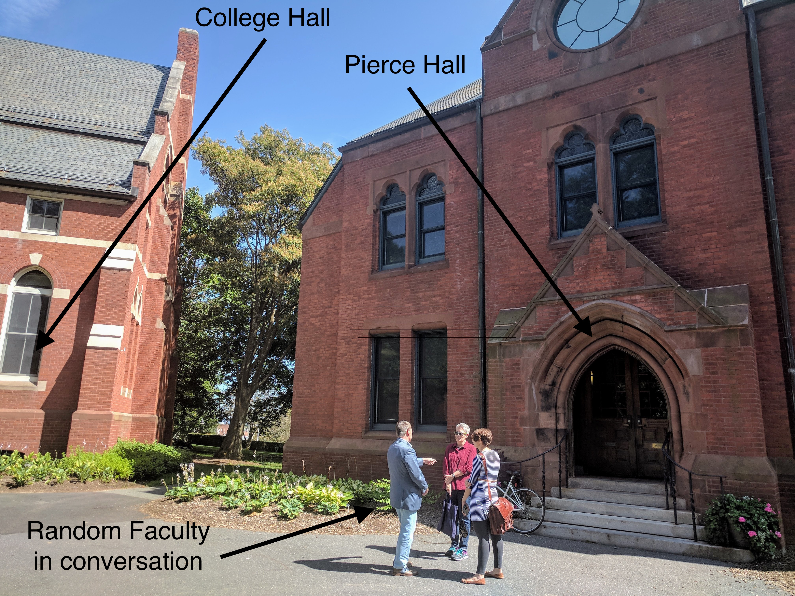

# Liberal Arts Advising

- Who am I? Simon Halliday, PhD. 
- Who else? You! My advisee
- My office: Pierce Hall 1.07
- Direction? Pierce Hall is next to College Hall, my office is in the back passage and turn to the right at the end of the passage (see pictures below)
- Email/hangouts: [shalliday+advising@smith.edu](shalliday+advising@smith.edu) Why is this my email address? Check [here](https://support.google.com/mail/answer/12096?hl=en)

## Things to Remember 

- Remember, your writing intensive (WI) course *does not* have to be in the Fall. 
- But, not all First Year Seminars (FYS) are available in the Spring. 

## What will we talk about? 

- What ideas fascinate you? 
- What drives you?
- What professional goals do you have? 
- What's your background? 
- What co-curriculars are you thinking of? Associations, societies, sports, volunteering? 
- How do you identify? *(I go by he/him)*
- Are you a domestic or an international student? *(I'm international)*
- Are you a first generation college attendee? *(I am first gen)*
- Are you prepared for the weather? *(I wasn't, but became so)*
- What major(s) interest you? *(Mine were Economics and English Lit)*
- Do you want to study abroad? If so, where? *(I didn't because I couldn't afford it)*
- Did you get an email about supplemental courses in Math or English? 
- Did you take any AP or IB courses? Did you get a 4 or 5 for AP? 
- Do you have any disabilities or health concerns I should know about? 

## What are my expectations of you? 

- presence
- communication 
- 

### Communicate with me

- If you are struggling academically or having personal issues with a professor, you need to let me know. Send me an email. IM me on Google hangouts. 
- If you are having concerns with mental health, let me know. 
- If you had holds on your account, let me know (often health or SFS and I can help you).
- 

## Resources at Smith 

- The Spinelli Quantitative Learning Center has a page called [Math Success At Smith](https://www.smith.edu/qlc/mathsuccessatsmith.html) -- use this to take ALEKS courses and review your understanding of calculus; ALEKS is *not* a placement test, it's a tool for you to review your learning and revision goals 
    - ALEKS is free for you to use (you don't pay anything, but Smith is paying for you to access it)
    - It takes somewhere between 2 and 3 hours to complete it (depending on what you do) and you have 48 hours to complete the test
    - You have 6 months to complete the learning modules 
    - There's a Moodle Page for incoming students and you have access to ALEKS on 
    - Where is the Spinelli Center? It has MOVED and is now in Seelye 207 (it used to be in the library, but had to move because of renovations)

- Pre-health
    - Make sure you go to the orientation talk Tuesday Sept 5th, 2-3pm, McConnell 103. 
    - Go to the [website](https://www.smith.edu/prehealth). 
    - Many kinds of health professions, not just MD: nursing, public health, vet. 
    - Explore your interests, you *may not* want to be a doctor, but have other interests in health
    - Don't forget the post-bac (a one-year intensive after you graduate that covers pre-health requirement), but do get some experience in a lab course during your time at Smith.  
    - Sometimes you need to get the courses at UMass if Smith doesn't have them (often true for nursing -- it gets Smith credit)
    - Typical first year courses include: CHM111, CHM118, BIO132/133, MTH111, PSY100, ENG118. Make sure that you take intro bio & into chem early! CHM111 is ONLY offered in the fall, so make sure you get in there. 
    - If you want to do JYA, you often can't if you're pre-health. You can do a semester abroad, but don't recommend a year. 