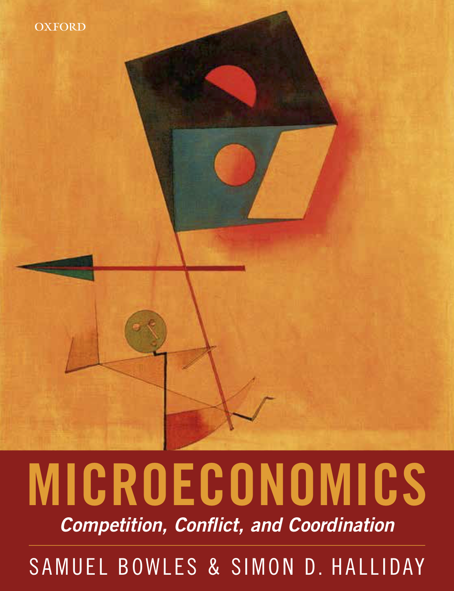
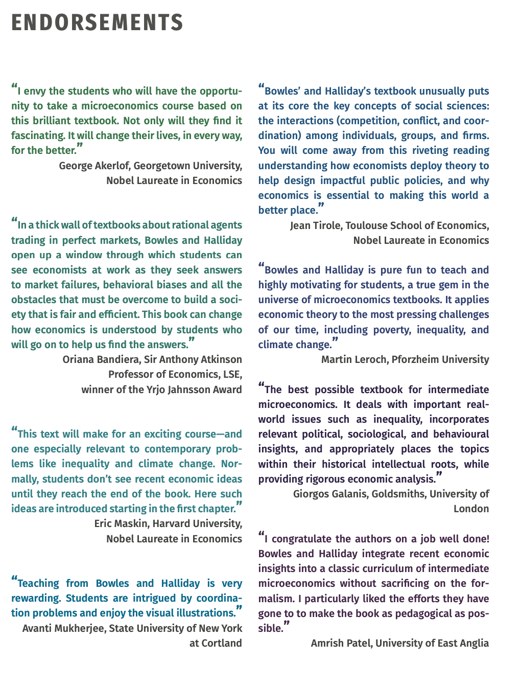
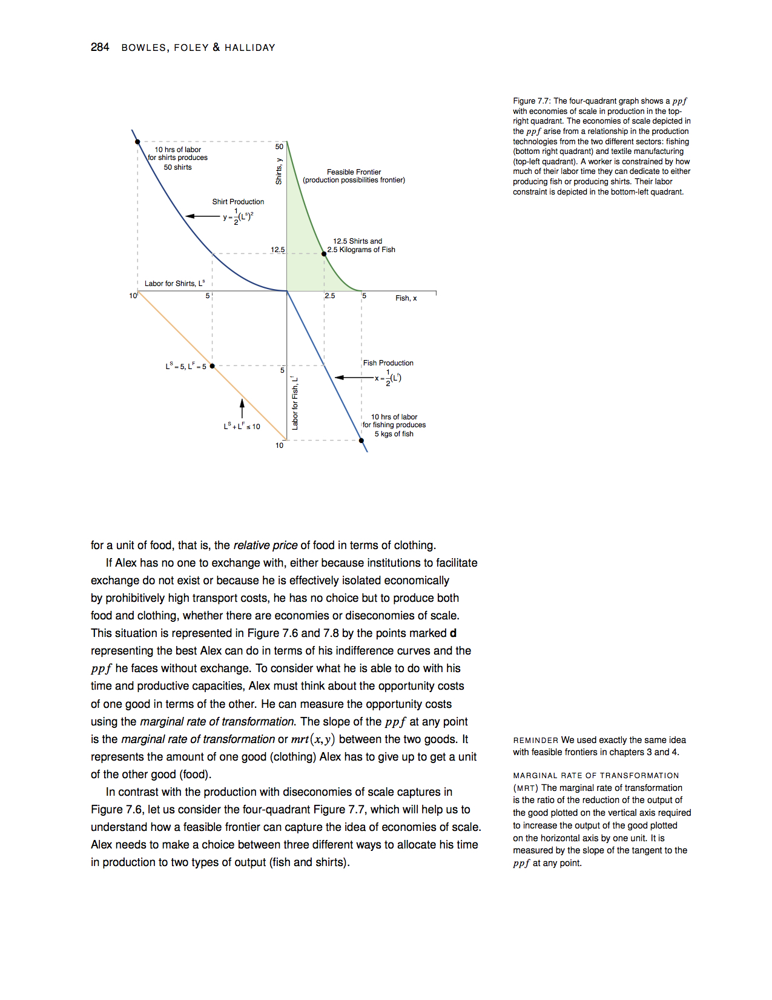

```{r setup, include=FALSE}
library(tufte)
library(knitr)
```

```{r cccbook, fig.margin = TRUE, fig.cap = "Book Cover", fig.width=3.5, fig.height=3.5, cache=TRUE, echo = FALSE}

```

> "Most of the people in the world are poor, so if we knew the economics of being 
> poor, we would know much of the economics that really matters ..."
>
> `r tufte::quote_footer('--- T. W. Schultz, 1980, Nobel Address: The Economics of Being Poor, p. 639')`

## Introduction
[Samuel Bowles](http://tuvalu.santafe.edu/~bowles/) and I (Simon Halliday) published our intermediate microeconomics textbook: *Microeconomics: Competition, Conflict and Coordination* (henceforth M:CCC) with Oxford University Press in July 2022. The book has been taught in a variety of universities and colleges in China, India, Ireland, Germany, Japan, South Africa, the US, the UK, and elsewhere. You can access it in a variety of ways.  

1. *Interactive ebook*: As an instructor, you can register for an inspection copy of the interactive e-book here: [global.oup.com/academic/product/microeconomics-9780198843207](https://global.oup.com/academic/product/microeconomics-9780198843207) You can see the button for "Request inspection copy" on the right-hand side of the page. 
2. *Free PDF*: As a student or instructor, you can read and download a free PDF of the book here: [simondhalliday.com/microeconomics/bowleshalliday_final_2022.pdf](http://simondhalliday.com/microeconomics/bowleshalliday_final_2022.pdf). 
This PDF version of the book lacks the interactive features of the e-book available at [www.vitalsource.com/en-uk/products/microeconomics-samuel-bowles-simon-d-v9780192581297?term=9780198843207](https://www.vitalsource.com/en-uk/products/microeconomics-samuel-bowles-simon-d-v9780192581297?term=9780198843207) and is made available free of charge for individual use under a CC BY-NC-ND license. 
3.  *Buying a hard copy or an e-book:* You can buy a copy of the book at a reputable retailer near you, or online through a variety of retailers, including modern monopolies like Amazon, e.g., [www.amazon.com/Microeconomics-Competition-Coordination-Samuel-Bowles/dp/0198843208](https://www.amazon.com/Microeconomics-Competition-Coordination-Samuel-Bowles/dp/0198843208). You can also purchase a copy of the e-book through [Vitalsource](https://www.vitalsource.com/en-uk/products/microeconomics-samuel-bowles-simon-d-v9780192581297?term=9780198843207), [Kortext](https://store.kortext.com/microeconomics-1985699), or your preferred e-book retailer. 

### Endorsements 
Here are some endorsements of the book by prominent economists: 

> "I envy the student who will have the opportunity to take a microeconomics course
> based on this brilliant textbook. Not only will they find it fascinating, it will 
> change their lives, in every way, for the better."
>
> `r tufte::quote_footer('--- George Akerlof, Georgetown University, Nobel Laureate in Economics')`

> "In a thick wall of textbooks about rational agents trading in perfect markets, 
> Bowles and Halliday open up a window through which students can see 
> economists at work as they seek answers to market failures, behavioral 
> biases, and all the obstacles that must be overcome to build
> a society that is fair and efficiency. This book can change how economics 
> is understood by students who will go on to help us find the answers."
>
> `r tufte::quote_footer('--- Oriana Bandiera, London School of Economics, winner of the Yrjo Jahnsson Award')`

> "This text will make for an exciting course--and one especially relevant to contemporary
> problems like inequality and climate change. Normally, students don't see recent economics
> ideas until they reach the end of the book. Here such ideas are introduced starting 
> in the first chapter."
>
> `r tufte::quote_footer('--- Eric Maskin, Harvard University, Nobel Laureate in Economics')`

> "Bowles and Halliday's textbook unusually puts at its core the key concepts of social 
> sciences: the interactions (competition, conflict, and coordination) among individuals, 
> groups, and firms. You will come away from this riveting reading understanding how 
> economists deploy theory to help design impactful public policies, and why 
> economics is essential to making this world a better place."
>
> `r tufte::quote_footer('--- Jean Tirole, Toulouse School of Economics, Nobel Laureate in Economics')`


## Supplementary content for M:CCC 
```{r endorsements, fig.margin = TRUE, fig.cap = "Endorsements: Akerlof, Bandiera, Maskin, Tirole, Mukherjee, Leroch, Galanis, and Patel", fig.width=3.5, fig.height=3.5, cache=TRUE, echo = FALSE}

```

### Accessing Supplementary Content
- If you are an instructor, please register as an instructor for an inspection copy above and OUP will provide access to a variety of additional supplementary content independent of that which I provide below. 
- You can access interactive graphs for M:CCC here: [https://bowles-halliday.github.io/bh-textbook/](https://bowles-halliday.github.io/bh-textbook/)
- You can access discussion questions [here](https://www.dropbox.com/s/ih7dnjx1gtob1zn/DiscussionQuestions_2022.06.20.docx?dl=0) (This is a Dropbox link)
- You can access further readings [here](https://www.dropbox.com/s/y3aor5g3eflfm3c/FutherReading_2022.06.20.docx?dl=0). (This is a Dropbox link)

## Additional Instructor Materials
A variety of supplementary materials exist for instructors on the OUP website:  
- slide decks
- problem sets
- quizzes

These resources are *not* made available on my private website so that they cannot be downloaded by students whose instructors are using them. 

## Multiple-choice questions and mathematical questions
The interactive e-book contains the following support for students: 
- embedded multiple-choice questions so students can test their understanding while they read - mathematical questions to test understanding of some of the mathematical and modeling concepts in the book. 
- checkpoint questions (with solutions available on the website's book online)

These are also available as PDFs with solutions (for the math questions and checkpoint questions) and MSWord documents and PDFs (for the MCQs). 


## What are the flavors M:CCC?
```{r fig-margin2, fig.margin = TRUE, fig.cap = "MBIE, 2006, PUP", fig.width=1, fig.height=1, cache=TRUE, echo = FALSE}
knitr::include_graphics('mbie.jpg')
```

Though written for undergraduates,  in content M:CCC has a strong flavor of Sam's graduate-level textbook, [*Microeconomics: Behavior, Institutions, and Evolution*](http://press.princeton.edu/titles/7610.html) published by Princeton University Press in 2006. As an advanced text, though, it is not suitable for many undergraduate classes because of the high level of the math.

```{r fig-margin3, fig.margin = TRUE, fig.width=3.5, fig.height=3.5, cache=TRUE, echo = FALSE}

```

```{r eos ppf, fig.margin = TRUE, fig.cap = "Example page: figure in Chapter 6 on Economies of Scale and the Production Possibilities Frontier", echo = FALSE}

```

While our text does not presume or require as a prerequisite any particular introduction to economics, M:CCC would be an excellent follow-up text for introductory economics courses that use the *The Economy* produced by the Curriculum Open Access Resource in Economics ([CORE Project](http://www.core-econ.org/)) directed by [Wendy Carlin](http://www.core-econ.org/contributors/) and of which Sam is a co-author. 
CORE's *The Economy* is based on many similar themes to M:CCC.  

## What are the themes of M:CCC?

We cover the standard economic concepts taught to second-year or intermediate-level economics students including constrained optimization, opportunity costs, trade-offs, complements and substitutes, Nash equilibrium, Pareto efficiency, and risk. 

But many of the themes of the book are unlikely to be encountered in most intermediate microeconomics texts. 

- *What is economics about?*  we go beyond the usual focus on markets and deal with the full range of social interactions and how people seek to coordinate their activities so as to secure their well being, including "the wealth and poverty of nations and people," environmental degradation, and conflict over the division of mutual gains from trade.
- *Evidence*: economics is an empirical science that relies on  experiments -- from the lab and the field -- and survey and other data to test its theories about how people, organizations, and economies behave and to illustrate applications of these theories to public policy.
- *Preferences*: people are both generous and self-interested, morally motivated and amoral and we respond to social norms of fairness.
- *Economic actors*: firms, banks, buyers and sellers are often price-makers rather than passive price-takers. 
- *Rents*: social interactions allow gains from trade, but "the market" alone does not determine how these rents will be distributed.
- *Institutions*: institutions -- laws, norms, and mutual expectations -- affect how social interactions unfold and who gets what and why.
- *Efficiency and fairness*: outcomes are evaluated along the dimensions  of efficiency and fairness rather than solely by the Pareto criterion.
- *Power and social norms*: because contracts are incomplete in labor, credit and other important markets, the terms of an exchange depend on the exercise of power and norms other than the simple pursuit of self-interest.
- *A micro-foundation for a new macro*: equilibrium unemployment and wealth constraints on borrowing provide the basis of a modern macroeconomics, without special *ad hoc* assumptions. 
- *Increasing returns*: along with other sources of positive feedbacks, result in multiple equilibria in many situations, so that history matters because history may determine which equilibrium prevails. 
- *External effects*: positive and negative external effects ("externalities") pervade social interactions and people and firms routinely make decisions that affect how well or how poorly their counterparts will do.

## Provenance
It’s hard to know exactly where your own ideas come from, but for us, those implicated certainly include:

- *Adam Smith*  taught us that people are both selfish and other-regarding and that  markets are  coordination devices that under some conditions  allow socially desirable decentralized solutions to the question of how society's resources should be used. 
- *Karl Marx* stressed that conflicts over the products of human labor are an intrinsic feature in any economy,  that our preferences are shaped by our circumstances and that capitalism is a moving target that requires dynamic analysis.
- *Augustin Cournot* the mathematician, taught economics  to formally model how profit-maximizing firms interact in situations different from what later came to be called "perfect competition."
- *Alfred Marshall* studied markets both  factually and mathematically,  giving us an exemplar of empirically grounded formal reasoning in microeconomics.
- *Friedrich Hayek* pioneered the idea that markets are information-processing mechanisms and that economics is about how changing information results in changes in the economy.
- *Ronald Coase*, like Marx, stressed the importance of power as an economic concept and the importance of firms and other non-market institutions and also taught that market failures and other social problems can be addressed by a combination of private bargaining and governmental intervention.
- *Elinor Ostrom*, the political scientist, was honored with a Nobel in economics for demonstrating the power of a multi-disciplinary and empirical approach to understanding how societies can confront their environmental and other coordination problems. 

We incubated many of these ideas at the Santa Fe Institute (where Sam serves on the faculty), a center of interdisciplinary and dynamic problem-centered modeling. 

## Contents
Below is an abridged table of contents for the book.  

| Chapter  | Title   |
|---|---|---|
| Preface | - |
| Part I | People, Economy & Society |
| 1 | Society: Coordination Problems & Economic Institutions |
| 2 | People: Preferences, Beliefs & Constraints |
| 3 | Doing the Best You Can: Constrained optimization | 
| 4 | Property, Power & Exchange: Mutual Gains & Conflicts | 
| 5 | Coordination Failures & Institutional Responses| 
| Part II | Markets for Goods and Services | 
| 6 | Production: Technology & Specialization | 
| 7 | Demand: Willingness to Pay & Prices | 
| 8 | Supply: Firms' Costs, Output & Profit | 
| 9 | Competition, Rent-Seeking & Market Equilibriation |
| Part III | Markets with Incomplete Contracting |
| 10 | Information: Contracts, Norms & Power |
| 11 | Work, Wages, & Unemployment |
| 12 | Interest, Credit & Wealth Constraints |
| Part III | Economic Systems: Ideal & Imperfect | 
| 13 | A Risky & Unequal World | 
| 14 | Perfect Competition & the Invisible Hand |
| 15 | Capitalism: Innovation & Inequality | 
| 16 | Public Policy & Mechanism Design | 

## Calculus and Graphics
We use calculus in the book, but almost all of the calculus is contained in boxes (M-Notes). 
We try to follow Alfred Marshall's maxims with the mathematics:  

```{marginfigure}
Alfred Marshall, 1906, Letter to Arthur Lyon Bowley. Collected in A. C. Pigou, 1966, *Memorials of Alfred Marshall*, pp. 427-428.
```

> "I had a growing feeling in the later years of my work at the subject that a good mathematical theorem dealing with economic hypotheses was very unlikely to be good economics: and I 
> went more and more on the rules
>
> 1. Use mathematics as a shorthand language, rather than an engine of inquiry. 
> 2. Keep to them till you have done.
> 3. Translate into English. 
> 4. Then illustrate by examples that are important in real life. 
> 5. Burn the mathematics. 
> 6. If you can't succeed in (4), burn (3). 
>
> This last I did often."

We may not have burned as much of the mathematics as we ought to have done, but we try to restrain the mathematics to when it is most necessary. 
For the most part, the economics is conveyed through *graphical* intuition accompanied by algebra. 
All of the graphics are also available on github (see Simon Halliday's github repo [bfh-textbook](https://github.com/simondhalliday/bfh-textbook/)). 
As you can see in the supplementary materials above, we have provided interactive graphics based on these figures produced by Bridget Diana and based on work by Chris Makler, whose work at [econgraphs.org](https://www.econgraphs.org/) we recommend both for us with our book and for use in other courses using other books. 

We cover Lagrangians in a set of mathematics notes and in the mathematical appendix.

## Pedagogical Approach

Our objective is not simply to teach students "how economists think" by algorithmic training using toy models, but to to teach economics as a social science: an inquiry into the main challenges our society faces and the policy options available to us to confront the challenges.

To do this we begin each chapter with one or more empirical puzzles or historical episodes that economic theory should be able to illuminate. Models are taught as a way of addressing real world problems and questions. 

Our approach is informed by the latest ideas in the learning sciences. 
```{marginfigure}
See, for example, Brown, Roediger and McDaniel, 2014, *Make It Stick*, Harvard University Press/Belknap Press, Cambridge, MA. 
```

- With our quizzes, we recommend regular *testing* to improve learning and retention; students obtain immediate feedback and the instructor can respond to student needs (quizzes and flashcards assist with this)
- With in-class worksheets and think-pair-share exercises enabled by the worksheets, students again get *immediate feedback* and can learn by teaching each other
- We repeat the use of economic ideas throughout the book -- students learn a core set of economic ideas and apply them to a diverse array of problems -- and space them with the introduction of new ideas so that students go to and fro between new and old ideas, and between old and new applications of familiar ideas
- We recommend that instructors *space out practice* using the quizzes, problem sets and worksheets
- Attempting a problem *before knowing a solution* provides learning benefits (even when getting to an incorrect solution initially) 
- *Varied* practice is important to learning, which again motivates our use of the different types of testing and learning work (quizzes, worksheets, problem sets)
```{marginfigure}
*Elaboration* is "the process of giving new material meaning by expressing it in your own words and connecting it with what you already know." (Brown, Roediger and McDaniel, 2014, p. 5)
```
- Simon also asks students to engage in a practice where he distributes index cards and students write 3 ideas they remember from the previous class and to explain them in their own words (for a Monday class recalling a Friday class this is particularly useful). Simon has found this practice to be useful because it involves both practicing *recall* and *elaboration*. 
