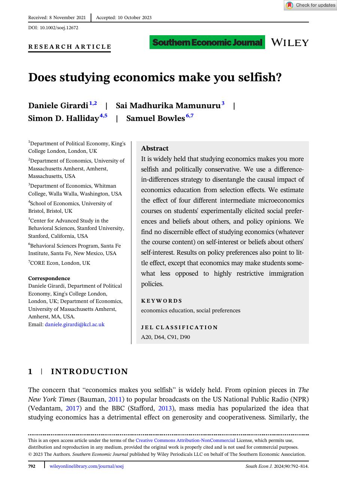

```{=html}
<div class="research-page">
  <section class="research-hero">
    <div>
      <span class="research-label">Research</span>
      <h1>Books, articles, and projects on economics, education, and civic life.</h1>
      <p class="research-lede">
        My work sits across behavioral and experimental economics, economics education,
        applied and development economics, and civic thought. The featured reader highlights
        selected publications; the traditional list below keeps the full record easy to scan.
      </p>
    </div>
    <aside class="research-side-note">
      <span>Current appointment</span>
      Associate Research Professor and Associate Director, Center for Economy and Society,
      SNF Agora Institute, Johns Hopkins University.
    </aside>
  </section>

  <section class="research-section" id="books">
    <div class="research-section-head">
      <span class="research-label">Books</span>
      <h2>Textbooks and open learning projects</h2>
    </div>
    <div class="research-book-grid">
      <a class="research-book-card research-book-card--uoe" href="http://books.core-econ.org/understanding-our-economy/">
        <span>Open textbook</span>
        <strong>Understanding Our Economy</strong>
        <p>With the CORE Econ team, forthcoming 2026.</p>
      </a>
      <a class="research-book-card research-book-card--micro" href="microeconomics/">
        <span>Textbook</span>
        <strong>Microeconomics</strong>
        <p><em>Competition, Conflict, and Coordination</em>, with Samuel Bowles, Oxford University Press, 2022.</p>
      </a>
    </div>
  </section>

  <section class="research-section" id="featured-publications">
    <div class="research-section-head">
      <span class="research-label">Featured Publications</span>
      <h2>Article previews with first-page context</h2>
      <p>
        Use the tabs or previous/next controls to move through selected papers. Each preview
        links to the PDF, journal page, and embedded reader.
      </p>
    </div>

    <div class="article-browser">
      <div class="article-rail" role="tablist" aria-label="Featured articles">
        <button class="article-tab" type="button" role="tab" aria-selected="true" data-article="0">
          <span>Behavioral</span>
          <strong>Does studying economics make you selfish?</strong>
        </button>
        <button class="article-tab" type="button" role="tab" aria-selected="false" data-article="1">
          <span>Education</span>
          <strong>Interactive model visualization</strong>
        </button>
        <button class="article-tab" type="button" role="tab" aria-selected="false" data-article="2">
          <span>Development</span>
          <strong>Weather shocks and employment</strong>
        </button>
      </div>

      <article class="article-feature">
        <a class="page-preview" id="preview-link" href="papers/publications/girardi-mamunuru-halliday-bowles-2023-selfish.pdf">
          
        </a>
        <div class="article-copy">
          <span class="research-label" id="article-category">Behavioral and experimental economics</span>
          <h2 id="article-title">Does studying economics make you selfish?</h2>
          <p class="citation" id="article-citation">
            D. Girardi, S. Mamunuru, Simon D. Halliday, and Samuel Bowles.
            <em>Southern Economic Journal</em>, 2023.
          </p>
          <div class="summary">
            <p id="article-summary-1">
              A study of whether economics education changes students' social preferences and political beliefs.
              The paper uses variation across intermediate microeconomics courses to examine whether exposure
              to economics makes students more self-interested.
            </p>
            <p id="article-summary-2">
              The preview image gives visitors a sense of the article as a published object, while the
              summary explains why someone might want to read it.
            </p>
          </div>
          <div class="research-actions">
            <a class="research-button primary" href="#embedded-pdf">Read embedded PDF</a>
            <a class="research-button" id="pdf-link" href="papers/publications/girardi-mamunuru-halliday-bowles-2023-selfish.pdf">PDF</a>
            <a class="research-button" id="journal-link" href="https://doi.org/10.1002/soej.12672">Journal</a>
          </div>
        </div>
      </article>

      <div class="reader-nav" aria-label="Article navigation">
        <span class="reader-status" id="reader-status">Article 1 of 3: Behavioral</span>
        <div class="reader-nav__buttons">
          <button type="button" id="prev-article">Previous article</button>
          <button class="next" type="button" id="next-article">Next article</button>
        </div>
      </div>

      <div class="embed" id="embedded-pdf">
        <div class="embed-header">
          <span id="embed-title">Embedded PDF preview: Does studying economics make you selfish?</span>
          <a id="open-pdf-link" href="papers/publications/girardi-mamunuru-halliday-bowles-2023-selfish.pdf">Open full PDF</a>
        </div>
        <iframe id="pdf-frame" src="papers/publications/girardi-mamunuru-halliday-bowles-2023-selfish.pdf" title="Embedded PDF: Does studying economics make you selfish?"></iframe>
      </div>
    </div>
  </section>

  <section class="research-section" id="publications">
    <div class="research-section-head">
      <span class="research-label">Traditional List</span>
      <h2>Publications, papers, and projects</h2>
      <p>
        A compact list for citation copying, PDF downloads, journal pages, dashboards, and current projects.
      </p>
    </div>

    <div class="traditional-list">
      <div class="list-group">
        <h3>Behavioral and Experimental Economics</h3>
        <ul class="publication-list">
          <li>
            D. Girardi, S. Mamunuru, Simon D. Halliday, and Samuel Bowles, "Does studying economics make you selfish?" <em>Southern Economic Journal</em>, 2023.
            <span class="list-tools"><a href="papers/publications/girardi-mamunuru-halliday-bowles-2023-selfish.pdf">PDF</a> <a href="https://doi.org/10.1002/soej.12672">Journal</a></span>
          </li>
          <li>
            Simon D. Halliday and Jonathan Lafky, "Reciprocity through ratings: An experimental study of bias in evaluations," <em>Journal of Behavioral and Experimental Economics</em>, 83, 101480, 2019.
            <span class="list-tools"><a href="papers/publications/halliday-lafky-2019-reciprocity-ratings.pdf">PDF</a> <a href="https://doi.org/10.1016/j.socec.2019.101480">Journal</a></span>
          </li>
          <li>
            Gabriel Burdin, Simon D. Halliday, and Fabio Landini, "The hidden benefits of abstaining from control," <em>Journal of Economic Behavior & Organization</em>, 147, 1-12, 2018.
            <span class="list-tools"><a href="papers/publications/burdin-halliday-landini-2018-hidden-benefits-control.pdf">PDF</a> <a href="https://doi.org/10.1016/j.jebo.2017.12.018">Journal</a></span>
          </li>
        </ul>
      </div>

      <div class="list-group">
        <h3>Applied and Development Economics</h3>
        <ul class="publication-list">
          <li>
            Harriet Brookes-Gray, Vis Taraz, and Simon D. Halliday, "The impact of weather shocks on employment outcomes: evidence from South Africa," <em>Environment and Development Economics</em>, 28(3), 285-305, 2022.
            <span class="list-tools"><a href="papers/publications/brookes-gray-taraz-halliday-2023-weather-shocks.pdf">PDF</a> <a href="https://doi.org/10.1017/S1355770X22000237">Journal</a></span>
          </li>
        </ul>
      </div>

      <div class="list-group">
        <h3>Economics Education</h3>
        <ul class="publication-list">
          <li>
            Simon D. Halliday and S. M. Mamunuru, "Updating our approach to intermediate microeconomics," <em>The American Economist</em>, 70(2), 2025.
            <span class="list-tools"><a href="papers/publications/halliday-mamunuru-2025-intermediate-microeconomics.pdf">PDF</a> <a href="https://doi.org/10.1177/05694345251353131">Journal</a></span>
          </li>
          <li>
            Simon D. Halliday, C. Makler, D. McKee, and A. Papadopoulou, "Improving student comprehension through interactive model visualization," <em>International Review of Economics Education</em>, 47, 100296, 2024.
            <span class="list-tools"><a href="papers/publications/halliday-makler-mckee-papadopoulou-2024-model-visualization.pdf">PDF</a> <a href="https://doi.org/10.1016/j.iree.2024.100296">Journal</a></span>
          </li>
          <li>
            Simon D. Halliday, "Data literacy in economic development," <em>The Journal of Economic Education</em>, 50(3), 284-298, 2019.
            <span class="list-tools"><a href="papers/publications/halliday-2019-data-literacy-economic-development.pdf">PDF</a> <a href="https://doi.org/10.1080/00220485.2019.1618762">Journal</a></span>
          </li>
          <li>
            Simon D. Halliday, "Promoting an ethical economics classroom through partnership," <em>International Journal for Students as Partners</em>, 3(1), 182-189, 2019.
            <span class="list-tools"><a href="papers/publications/halliday-2019-ethical-economics-classroom.pdf">PDF</a> <a href="https://doi.org/10.15173/ijsap.v3i1.3623">Journal</a></span>
          </li>
          <li>
            Thomas Dvorak, Simon D. Halliday, Michael O'Hara, and Aaron Swoboda, "Efficient empiricism: Streamlining teaching, research, and learning in empirical courses," <em>The Journal of Economic Education</em>, 50(3), 242-257, 2019.
            <span class="list-tools"><a href="papers/publications/dvorak-halliday-ohara-swoboda-2019-efficient-empiricism.pdf">PDF</a> <a href="https://doi.org/10.1080/00220485.2019.1618765">Journal</a></span>
          </li>
        </ul>
      </div>

      <div class="list-group">
        <h3>Chapters in Books</h3>
        <ul class="publication-list">
          <li>
            Simon D. Halliday, E. Bottorff, M. Lopez, A. Johnson, and A. Papadopoulou, "Taking an economic literacy approach in understanding our economy," in <em>Teaching Literacy-Targeted Principles of Economics</em>, A. Cohen and S. Wolla, eds., Edward Elgar, forthcoming 2026.
            <span class="list-tools"><a href="https://simondhalliday.com/uoe_economic_literacy/">Dashboard</a></span>
          </li>
          <li>Simon D. Halliday and J. E. Tierney, "Revolutionizing teaching economics online with artificial intelligence," in <em>Teaching Economics Online</em>, A. al Bahrani and P. Chaudhury, eds., Edward Elgar, 2024.</li>
          <li>Simon D. Halliday and E. C. Marshall, "Where is the 'behavioral' in introductory microeconomics?" in <em>Teaching Principles of Microeconomics</em>, M. Maier and P. Ruder, eds., Edward Elgar, 2023.</li>
          <li>Simon D. Halliday, "Global public goods," in <em>Managing the Economy</em>, C. Santos and M. Higginson, eds., Open University Press, 2014.</li>
        </ul>
      </div>

      <div class="list-group">
        <h3>Under Review</h3>
        <ul class="publication-list">
          <li>Samuel Bowles, Wendy Carlin, Simon D. Halliday, and Sahana Subramanyam, "What do we think an economist should know? A machine learning investigation of research and intermediate-level texts," 2025, withdrawn revise and resubmit at <em>History of Political Economy</em>.</li>
          <li>Simon D. Halliday, Jonathan Lafky, and Alistair Wilson, "Honesty at the margin and in the limit," 2025, revise and resubmit at <em>AEJ: Microeconomics</em>.</li>
        </ul>
      </div>

      <div class="list-group">
        <h3>Works in Progress</h3>
        <ul class="publication-list">
          <li>M. Bechdolf, Simon D. Halliday, E. Malthouse, and A. Papadopoulou, "Beyond the contract: Fairness, observability, and discretionary effort."</li>
          <li>Simon D. Halliday and G. Liu, "Civic thought and economic education."</li>
          <li>
            Simon D. Halliday, Emily Marshall, Glory Liu, Anthony Underwood, and Doug Norton, "PPE and Civic Thought Programs in American Higher Education."
            <span class="list-tools"><a href="https://ppe-civicthought-requirements.simondhalliday.com/">Dashboard</a></span>
          </li>
          <li>Simon D. Halliday, V. Jayaraman, and P. Tripathi, "Teaching an economic model of segregation: Evidence, best responses, an in-class activity, and a critical reflection."</li>
          <li>Simon D. Halliday, "Reflective writing and course stories in economics teaching."</li>
          <li>Simon D. Halliday, "Teaching social preferences."</li>
          <li>Simon D. Halliday and Oumayma Koulouh, "Lies, labor and luck: Comparing lying in real-effort and luck tasks."</li>
        </ul>
      </div>

      <div class="list-group">
        <h3>Policy and Commentary</h3>
        <ul class="publication-list">
          <li>Malcolm Keswell, Tim Brophy, Simon D. Halliday, and Susan Godlonton, <em>Report to the Department of Land Affairs on the Quality of Life Survey, South Africa</em>, 2008.</li>
          <li>
            Gabriel Burdin, Simon Halliday, and Fabio Landini, "Why using technology to spy on home-working employees may be a bad idea," <em>LSE Business Review</em>, 2020.
            <span class="list-tools"><a href="https://blogs.lse.ac.uk/businessreview/2020/06/17/why-using-technology-to-spy-on-home-working-employees-may-be-a-bad-idea/">Article</a></span>
          </li>
        </ul>
      </div>
    </div>
  </section>
</div>

<script>
const articles = [
  {
    tabLabel: "Behavioral",
    category: "Behavioral and experimental economics",
    title: "Does studying economics make you selfish?",
    citation: 'D. Girardi, S. Mamunuru, Simon D. Halliday, and Samuel Bowles. <em>Southern Economic Journal</em>, 2023.',
    summary1: "A study of whether economics education changes students' social preferences and political beliefs. The paper uses variation across intermediate microeconomics courses to examine whether exposure to economics makes students more self-interested.",
    summary2: "The preview image gives visitors a sense of the article as a published object, while the summary explains why someone might want to read it.",
    preview: "img/article-previews/selfish.jpg",
    pdf: "papers/publications/girardi-mamunuru-halliday-bowles-2023-selfish.pdf",
    journal: "https://doi.org/10.1002/soej.12672"
  },
  {
    tabLabel: "Education",
    category: "Economics education",
    title: "Improving student comprehension through interactive model visualization",
    citation: 'Simon D. Halliday, C. Makler, D. McKee, and A. Papadopoulou. <em>International Review of Economics Education</em>, 2024.',
    summary1: "A paper on how interactive visualizations can help students reason through economic models. The emphasis is on comprehension: whether students can connect model structure, movement, and interpretation.",
    summary2: "This format works well for selected education papers because the visitor can see the artifact, read a short explanation, and immediately open the published version.",
    preview: "img/article-previews/model-visualization.jpg",
    pdf: "papers/publications/halliday-makler-mckee-papadopoulou-2024-model-visualization.pdf",
    journal: "https://doi.org/10.1016/j.iree.2024.100296"
  },
  {
    tabLabel: "Development",
    category: "Applied and development economics",
    title: "The impact of weather shocks on employment outcomes",
    citation: 'Harriet Brookes-Gray, Vis Taraz, and Simon D. Halliday. <em>Environment and Development Economics</em>, 2023.',
    summary1: "An applied paper on weather shocks and employment outcomes in South Africa. It connects climate variation to labor-market effects in a setting where adaptation and vulnerability matter.",
    summary2: "The first-page preview signals that this is a published research article while the summary keeps the page readable for visitors who are not specialists.",
    preview: "img/article-previews/weather-shocks.jpg",
    pdf: "papers/publications/brookes-gray-taraz-halliday-2023-weather-shocks.pdf",
    journal: "https://doi.org/10.1017/S1355770X22000237"
  }
];

const tabs = Array.from(document.querySelectorAll(".article-tab"));
const articleFeature = document.querySelector(".article-feature");
const fields = {
  previewLink: document.getElementById("preview-link"),
  previewImage: document.getElementById("preview-image"),
  category: document.getElementById("article-category"),
  title: document.getElementById("article-title"),
  citation: document.getElementById("article-citation"),
  summary1: document.getElementById("article-summary-1"),
  summary2: document.getElementById("article-summary-2"),
  pdfLink: document.getElementById("pdf-link"),
  journalLink: document.getElementById("journal-link"),
  embedTitle: document.getElementById("embed-title"),
  openPdfLink: document.getElementById("open-pdf-link"),
  pdfFrame: document.getElementById("pdf-frame"),
  status: document.getElementById("reader-status")
};

let currentArticle = 0;

function showArticle(index, shouldScroll = false) {
  currentArticle = (index + articles.length) % articles.length;
  const article = articles[currentArticle];

  fields.previewLink.href = article.pdf;
  fields.previewImage.src = article.preview;
  fields.previewImage.alt = `First page preview of ${article.title}`;
  fields.category.textContent = article.category;
  fields.title.textContent = article.title;
  fields.citation.innerHTML = article.citation;
  fields.summary1.textContent = article.summary1;
  fields.summary2.textContent = article.summary2;
  fields.pdfLink.href = article.pdf;
  fields.journalLink.href = article.journal;
  fields.embedTitle.textContent = `Embedded PDF preview: ${article.title}`;
  fields.openPdfLink.href = article.pdf;
  fields.pdfFrame.src = article.pdf;
  fields.pdfFrame.title = `Embedded PDF: ${article.title}`;
  fields.status.textContent = `Article ${currentArticle + 1} of ${articles.length}: ${article.tabLabel}`;

  tabs.forEach((tab, tabIndex) => {
    tab.setAttribute("aria-selected", String(tabIndex === currentArticle));
  });

  if (shouldScroll) {
    articleFeature.scrollIntoView({ block: "start", behavior: "smooth" });
  }
}

tabs.forEach((tab) => {
  tab.addEventListener("click", () => {
    showArticle(Number(tab.dataset.article), true);
  });
});

document.getElementById("prev-article").addEventListener("click", () => {
  showArticle(currentArticle - 1, true);
});

document.getElementById("next-article").addEventListener("click", () => {
  showArticle(currentArticle + 1, true);
});
</script>
```
