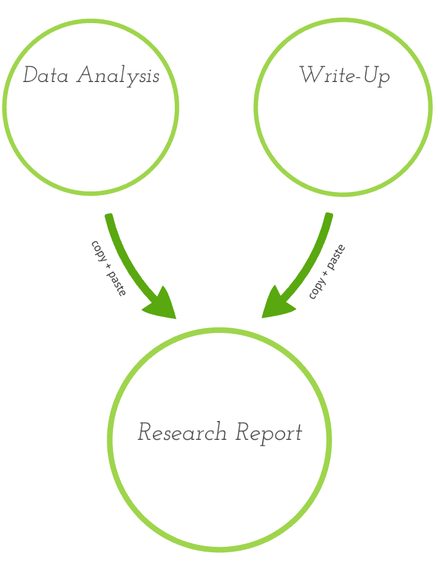
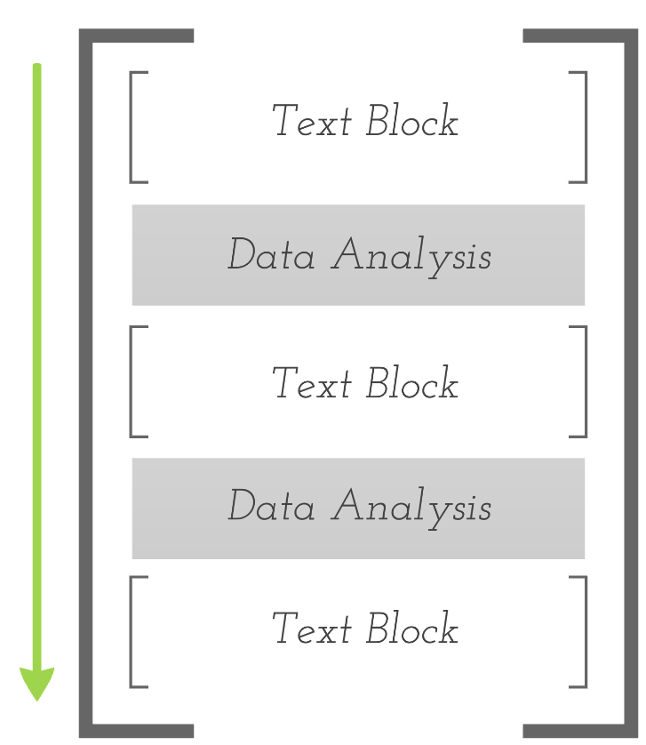
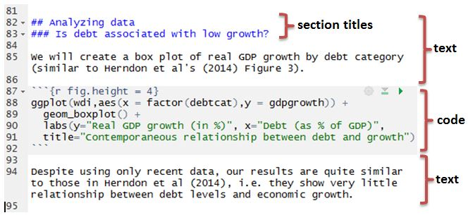
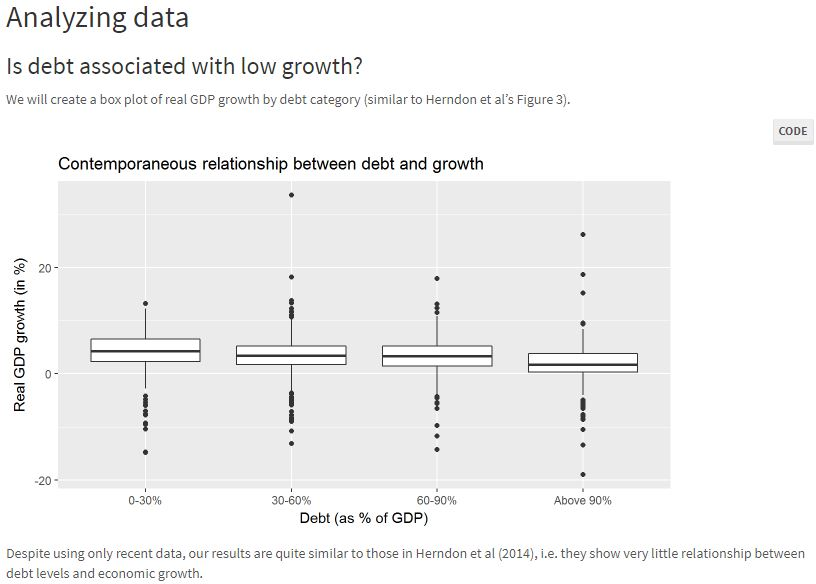

```{r setup, include = FALSE}
knitr::opts_chunk$set(echo = FALSE)
library(dplyr)
library(tidyr)
library(ggplot2)
library(plm)
library(dygraphs)
library(xts)
library(plotly)
library(shiny)
library(ggvis)
library(stargazer)
```


## What will I talk about? 
.large[
- How we have used R Markdown in our undergraduate courses  

- Reproducibility with R Markdown

- And some things that we think are just cool in Rmd. 

- BIG Thank you to Project TIER and the Alfred P. Sloan Foundation

- Currently R & R for J. Econ Ed... (fingers crossed)
]

---

## Lit & Gap

.huge[
Research about teaching empirics, data, basics of reproducibility

 - Capstone: McGoldrick (2008)
 - Reproducible Protocol: Ball & Madeiros (2012)
 - Data Literacy: Halliday (forthcoming)
 - Too advanced for UGs: Gentzkow & Shapiro (2014)
 - For professionals: Knittel and Metaxoglou (2018) 
 
Need one-stop-shop for *undergrads*.
]

---

# Our contribution

.huge[
- Teach *undergrads* reproducible research tools
- Cheaply 
- Efficiently & effectively
- High demand for skills
- Solution: R & RMarkdown
]

---

class: center

# What is R Markdown?

.huge[single document] 


.huge[for code,] 


.huge[output of code,] 


.huge[and prose]


---
## Benefits of R Markdown 
.large[- One-stop solution

- Work is *reproducible*

- Calibrated for collaboration

- Free (p = 0) 

- Broad & used in industry & research
]
---

# Costs and alternatives? 
.large[
Learning Curve for R and R Studio: 

- Packages facilitate learning: 

  - new packages: `tidyverse`, `mosaic`, `stargazer`
  
- error detection 
- autocomplete
- online educational courses
- plays well with Python (`reticulated Python`), SQL, JSON,
]

---

## Costs and alternatives? 
.large[
Stata and `dyndoc` (Stata 15)?

  - Too clunky (hard for students) 
  - different code for different formats (word, pdf, html)
  - doesn't produce output in the file (.do)
  - Conclusion: not a reasonable alternative
  - Not yet a "Stata Markdown"

Python and Jupyter Notebooks 

  - also free
  - not geared to statistical programming
  - no real educational server edition
]
---

## How we have used R Markdown
.large[
- Introductory econometrics
- Environmental Economics 
- Behavioral Economics
- Business analytics
- Seminars, theses and special studies


- Our Class sizes? 10-35 
    + Elsewhere: 80-120 (Duke, UCLA, Smith SDS/CS)
]
---

## R Markdown & Reproducibility 
.pull-left[
.large[
- What are traditional research reports? 
- Are they easily reproducible? 
- What gives us *soup to nuts* reproducibility? 
  - Easy Answer: R Markdown 
  - Hard answer: Scripted LaTeX + STATA
- Works with TIER Protocol
]
]

.pull-right[
```{r}
knitr::include_graphics("https://studyprayserve.files.wordpress.com/2017/09/perplexed.jpg")
```


]

---

## Traditional Reports

.pull-left[
```{r, out.width = "400px", fig.cap = "Courtesy of Bray, 2016"}

```
]
.pull-right[
.large[
The Good 

- familiar format, e.g. Word 
- easy learning curve

The Bad

- tough for reproducibility
- difficult to update
- mistakes crop up
- teams can't collaborate easily

The Ugly? 

- Word/GDocs = Ugly?
]
]

<!---

## R Markdown Report/Notebook? 
<div class="col2"> 
```{r, out.width = "400px", fig.cap = "Courtesy of Bray, 2016"}

```


The good

- easy to reproduce
- easy to edit/update 
- easy to collaborate
- standardized & fast

The bad

- students must learn syntax
- error-free to compile

The ugly? 

- inequality in student backgrounds

</div>
--->

---

# Raw Markdown

```{r, out.width = "800px", fig.cap = "Raw Markdown"}

```

---

# Knitted Markdown

```{r, out.width = "800px", fig.cap = "Knitted Markdown"}

```

---

# Text Formatting

    
    # Header 1

    ## Header 2

    ### Header 3

    This is normal sized text used in the body of our work. 

    For bullet points, we use dashes, e.g. 

    - Intro to RStudio
    - More content
      - a sub-point
    - Back to the original level
    
---

# Document Types

.large[
R Markdown can produce a variety of document types (other than the default `html` page):

- `pdf_document` makes a PDF with LaTeX (`.pdf`)
  
- `word_document` for Microsoft Word documents (`.docx`).
  
-`odt_document` for OpenDocument Text documents (`.odt`).
  
- `rtf_document` for Rich Text Format documents (`.rtf`) 
  
And others. 
]
---

# Presentation Types
.huge[
R Markdown can also produce a presentation (as with this presentation):

*   `io_slides` opens in your browser and interactive (`.html`)
  
*   `slidy` another browser based presentation format (`.html`)
  
*   `beamer` makes a PDF with LaTeX (`.pdf`)
]  

---

background-size: 100%
background-image: url(https://media.giphy.com/media/94iS62lx8CRQA/giphy.gif)

---
# Data work
.huge[
Think about data analysis as falling into three loose categories: 

- management & wrangling
- visualization & summary statistics
- modeling & inference

All of this occurs in the code "chunk"
]
---


# Code Chunk: Example 

The option `echo = TRUE` means that the code gets included in the rendered html. 

```{r cars, echo = TRUE}
summary(cars)
```


---

# Code chunks

.large[
- *Create a chunk*: Hit CMD + OPTION + I (MacOS) and CTL + ALT + I (Win)

- *Open a chunk*: Or type out three backticks ` folowed by {r} 

- *Close a chunk*: And then three more back ticks ` on another line. 

- *Options*: Within the {r} you can specify options, like {eval = FALSE} if you don't want it to evaluate the code

- *Labels*: Label the chunk, e.g. {r cars} labels the chunk "cars" in your ToC
]

---


# Slide with Plot (Reproduction of Sutter, 2009)

```{r Sutter-Data, echo = FALSE}
SutExp <- read.csv("data/sutterexperiment.csv")
SutExp <- 
  SutExp %>% 
  rename(session = Session, subject = Subject, r1 = R1, r2 = R2, r3 = R3, r4 = R4, r5 = R5, r6 = R6, r7 = R7, r8 = R8, r9 = R9, treatment = Treatment)

```

```{r summary-data, echo = FALSE}
groupAves <- 
  SutExp %>% 
  group_by(treatment) %>%
  summarise(r1 = mean(r1), r2 = mean(r2), r3 = mean(r3), r4 = mean(r4), r5 = mean(r5), r6 = mean(r6), r7 = mean(r7), r8 = mean(r8), r9 = mean(r9))
```

```{r narrow-data}
narrowAve <- 
  groupAves %>%
  gather(round, average, r1:r9)
```

.center[
```{r plot1, fig.height=4.5, fig.width=12, fig.retina=2, fig.align='center', message=FALSE, warning=FALSE}
Plot1 <- 
  narrowAve %>%
  filter(treatment == "individual" | treatment == "teamtreat" ) %>%
  group_by(treatment) %>%
  arrange(treatment)
Plot1 %>%
  ggplot(aes(x = round, y = average, color = treatment)) + 
  geom_point(aes(shape = treatment)) +
  geom_line(aes(group = treatment)) + 
  ylim(20, 80) +
  xlab("Round") +
  ylab("Average amount allocated") + 
  scale_x_discrete(labels = seq(1, 9, by = 1)) +  
  scale_colour_discrete(name = "Treatment",
                         breaks = c("individual", "teamtreat"),
                         labels = c("Indidividuals", "Teams")) +
  scale_shape_discrete(name = "Treatment",
                         breaks = c("individual", "teamtreat"),
                         labels = c("Indidividuals", "Teams"))
```
]

.center[I excluded the display of code ]

---
# Dynamic Graphs 

```{r dygraph, fig.height=4.5, fig.width=10, fig.retina=2, fig.align='center', message=FALSE, warning=FALSE, echo = FALSE}
Participation <- read.csv("data/labor_force_participation.csv")
Partdate <- as.Date(Participation$date)
MaleP <- xts(Participation$male, Partdate)
FemaleP <- xts(Participation$female, Partdate)
LFPR <- cbind(MaleP, FemaleP)
colnames(LFPR) <- c("Male", "Female")
dygraph(LFPR, main = "Labor Participation Rate Over Time") %>%
       dySeries("Male", label="Male")%>%
       dySeries("Female", label="Female")%>%
       dyAxis("x", label="Date")%>%
       dyAxis("y", label="Labor Force Participation")%>%
       dyHighlight(highlightSeriesOpts = list(strokeWidth = 3), 
                   highlightCircleSize = 4)%>%
       dyRangeSelector()
       #dyOptions(drawGrid = input$showgrid, 
                 #colors = RColorBrewer::brewer.pal(5, "Set2"))
```

.center[Same as FRED dynamic graphs (students think this is very cool!)]
---
# Plotly Graphs

```{r ancona, echo = FALSE}
AnconaBase <- read.csv("Data/ancona.csv")
Ancona <- 
  AnconaBase %>%
  rename(date = dTransDataVendita, 
         productid = iProdID, 
         productdescription = vchClasseProdottoDescrizione, 
         speciesname = vchSpecieDescrizione, 
         quantity = nTransQuantita, 
         unitprice = nTransPrezzoUnitario, 
         saleprice = nTransPrezzoVendita, 
         finalprice = nTransPrezzoFinale, 
         producerid = iProduttoreID, 
         qualityid = iQualitaID, 
         qualitydescription = vchQualitaDescrizione,
         caseid = nNumCasse)
AnconaAve <- 
  Ancona %>% 
  group_by(date) %>%
  summarise(price = round(mean(unitprice), 2), 
            meanquantity = mean(quantity), 
            quantity = round(sum(quantity), 2))
```

```{r plotly_Ancona, fig.height=4.5, fig.width=10, fig.retina=2, fig.align='center', message=FALSE, warning=FALSE}
AnconaPlot <- 
  AnconaAve %>% 
  ggplot(aes(x = price, y = quantity)) +
  geom_point() +
  geom_smooth(formula = y ~ x, se = FALSE, method = "lm") +
  xlab("Daily average price per kilogram (Euros)") +
  ylab("Daily quantity (kilograms)") +
  coord_flip() +  
  theme_bw()
ggplotly(AnconaPlot)
```
---
# Alter and check  data
```{r create uniqid}
SutExpUniq <- 
  SutExp %>% 
  mutate(uniqid = paste(session, treatment, subject, sep = "_"))
head(SutExpUniq)
```
---
# Statistical Tests

```{r}
SutNarrow <- 
  SutExpUniq %>%
  gather(round, value, r1:r9) %>%
  arrange(session, subject, treatment, team)
Plot1data <- 
  SutNarrow %>%
  filter(treatment == "individual" | treatment == "teamtreat" )
wilcox.test(value ~ treatment, data = Plot1data)
```

---
# Regression output 

```{r}
m1 <- lm(value ~ treatment, data = SutNarrow)
summary(m1)
```
---

# Or a Panel Regression
```{r}
m3 <- plm(value ~ treatment, data = SutNarrow, index = c("uniqid"), model = "random", effect = "time")
summary(m3)
```
---

# Table of data
```{r}
knitr::kable(head(iris), format = 'html')
```

---

# Fancy Output 
```{r, results = "asis"}
stargazer(m1, type = "html", 
          no.space = TRUE,
          keep.stat = c("n", "rsq"),
          omit.table.layout = "n")
```


---
# Math? 
.large[How about Bayes' Rule?]

$$Pr(\mbox{Outcome} | \mbox{signal}) = \frac{\theta p}{\theta p - (1 - \theta)(1 - p)}$$
.large[
R Markdown uses $\LaTeX$ for math and it immediately gets displayed in R Studio.  

- That is, $\LaTeX$ without the challenges of learning the packages, tables, etc that makes learning $\LaTeX$ so hard.
- In-line equations are bracketed by single dollar signs `$`. 
- Off-set equations are bracketed by double dollar signs `$$`. 
]
---
# What else? 
.large[
R Markdown and R Studio together:

- R Studio can show you the output of the commands *within* the R Markdown file ("lab notebook")
- R Studio has *error-detection* and *debugging* assistance for your code (unlike, e.g. STATA or aspects of Excel)
- Tab-completion of code!!!
- R Studio server hosted online and curate student experience
]

---

# Lessons from experience

.large[
- Students struggle with basic computing (working directory, file paths); but tab-completion helps

  -  drag-and-dropitis
  - inequality in baselines

- Students have to adjust to get Basics Right

  - Difference between a script (.R file - like a .do file) and a markdown document/notebook (.Rmd)
  - Difference between the .Rmd and the exported file: pdf, html, etc

- Students learn commands through graded assignments 
]


--- 


# Lessons from experience

- Students like (or are used to) WYSIWYG, which Rmd is not

 - Students are accustomed to MS Word & G docs which are WYSIWYG, but Rmd is not. 
- Installing packages

  - analogy: install apps (packages) to do different things on your phone (RStudio & R)
  - Chrome extensions

- Server = REALLY GREAT!


---


# Suggestions

.large[
- Use templates!
  - easy for students to "fill in blanks"
- Templates for projects & bibliography 
- Examples of math 
- Examples of tables 
- Use lab exercises liberally (please borrow ours!)
]


--- 


# Acknowledgments 

We took inspiration from many people along the way. We thank them and ask their forgiveness.

- Andrew Bray -- [Reproducibility 2.0](https://prezi.com/rtmytpb6iwsw/reproducible-20/)
- Nick Horton -- [Getting Started with R and R Md](https://www.amherst.edu/people/facstaff/nhorton/node/567498)
- Mine &Ccedil;etinkaya-Rundel -- [website](http://www2.stat.duke.edu/~mc301/)
- Hadley Wickham & Garrett Grolemund --  [r4ds](r4ds.had.co.nz)
- Danny Kaplan --  [DataComputing](http://data-computing.org/author/dtkaplan/)
- Amelia McNamara -- [website](http://www.science.smith.edu/~amcnamara/)
- Ben Baumer -- [website](http://www.science.smith.edu/~bbaumer/w/)
- Cosma Shalizi -- [R Markdown for Class Reports](http://www.stat.cmu.edu/~cshalizi/rmarkdown/)
- Randy Prium -- [website](https://www.calvin.edu/~rpruim/)


---

# R Link Love? 
New to R? 

- Check out the Computation and Visualization Consortium's week-long [workshop](https://www.macalester.edu/hhmi/curricularinnovation/cvc/) over the summer (dates June 12-16, Macalaster College - Kaplan, Prium & Horton)
- Consider subscribing to classes at [Datacamp.com](www.datacamp.com) (take the intro free of charge)
- Grolemund & Wickham, 2016, R for Data Science, [r4ds](r4ds.had.co.nz)
- Baumer, Horton & Kaplan, forthcoming, [Modern Data Science with R](https://www.crcpress.com/Modern-Data-Science-with-R/Baumer-Kaplan-Horton/p/book/9781498724487). 
- Florian Heiss "Introductory Econometrics with R" (2016)


---
# How we have used R Markdown: Michael

Senior thesis seminar with 9 students

* Very little background
* All stages in R Markdown
    + Data manipulation, visualization, analysis
    + Presentations 
    + Final paper
---

## How we've used R Markdown: Michael

Advantages: 

- To students
    - One environment for everything
    
- To me
    - Full reproducibility of all 9 papers (one award)
    - Reproduce in one (!) document
    - Professional appearance (with template)

Cost

* Somewhat higher startup cost in teaching R and R Studio

---

# How we have used R Markdown: Aaron

* Create slides in an Econometrics course
* Final project in senior research seminar 
* Create custom progress reports for students
* Interactive shiny apps for micro students

---

# How we have used R Markdown: Simon

* Behavioral Economics (upper-level; 20-35 students)
* Slides, notes and assignments & labs
* Students do a reproducible research project
* Reproduce the results of a published paper 
* Propose a new experimental design to test a new hypothesis
